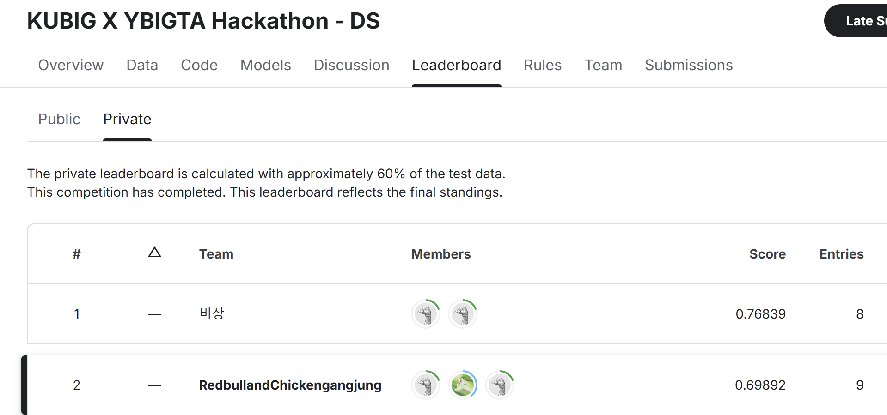

# 24-2-KUBIG X YBIGTA Hackathon

## 📁 프로젝트 폴더 구조

```plaintext
24-2-KUBIG X YBIGTA Hackathon/
│-- README.md
├── data/
│   │-- eda.py
│   │-- avazu_test_data.csv
│   │-- avazu_train_data.csv
│   │-- sample_submission_hackathon.csv
├── model/
│   ├── boosting/                  
│   │   │-- catboost_baseline.py   
│   │   │-- LGBM.py  
│   │   │-- LGBM_config.yaml     
│   │   └── LGBM_baseline.py    
├── ensemble/
│   │-- ensemble.py
│   ├── before/ # 앙상블 할 csv파일 위치
│   ├── after/
├── convert/ # 회귀문제 결과를 이진분류 결과로 바꿔줌
│   │-- convert.py # 
│   ├── before/ # 바꿔줄 csv파일 위치
│   ├── after/
├── submission/ # 결과물들 저장위치
```
# Team: RedbullandChickengangjung

## Team Member Info

| Name   | Github Username | Department | e-mail                    |
| ------ | --------------- | ---------- | ------------------------- |
| 강민정 | MinJeonging      |      DS     | ejkds60@yonsei.ac.kr     |
| 김예찬 | yechance7        |      DS/DE  | blueflaver@yonsei.ac.kr  |
| 이동진 | dongj12          |      DS     | dongj1210@naver.com      |

## Result


