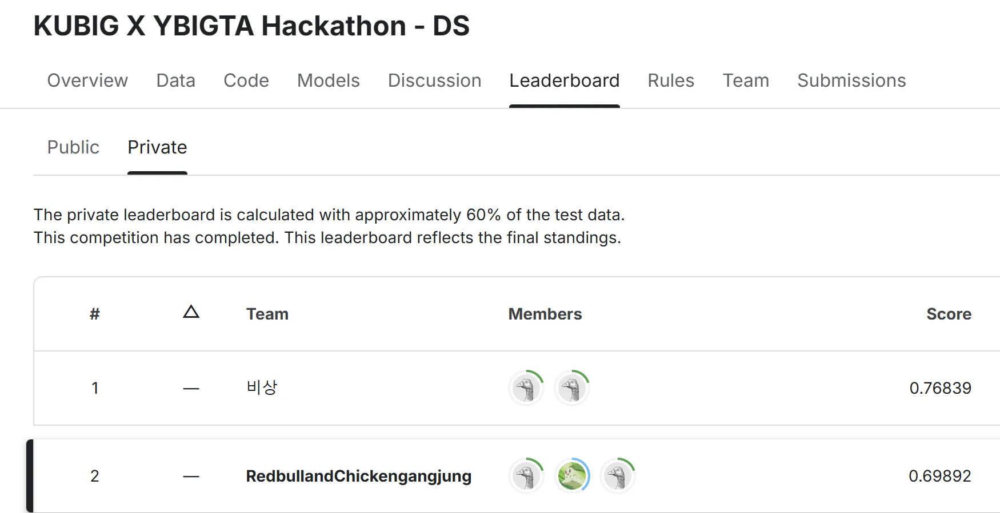

# 24-2-KUBIG X YBIGTA Hackathon

## 📁 프로젝트 폴더 구조

```plaintext
24-2-KUBIG X YBIGTA Hackathon/
│-- README.md
├── data/
│   │-- eda.py
│   │-- avazu_test_data.csv
│   │-- avazu_train_data.csv
│   │-- sample_submission_hackathon.csv
├── model/
│   ├── boosting/                  
│   │   │-- catboost_baseline.py   
│   │   │-- LGBM.py  
│   │   │-- LGBM_config.yaml     
│   │   └── LGBM_baseline.py    
├── ensemble/
│   │-- ensemble.py
│   ├── before/ # 앙상블 할 csv파일 위치
│   ├── after/
├── convert/ # 회귀문제 결과를 이진분류 결과로 바꿔줌
│   │-- convert.py # 
│   ├── before/ # 바꿔줄 csv파일 위치
│   ├── after/
├── submission/ # 결과물들 저장위치

# Result

